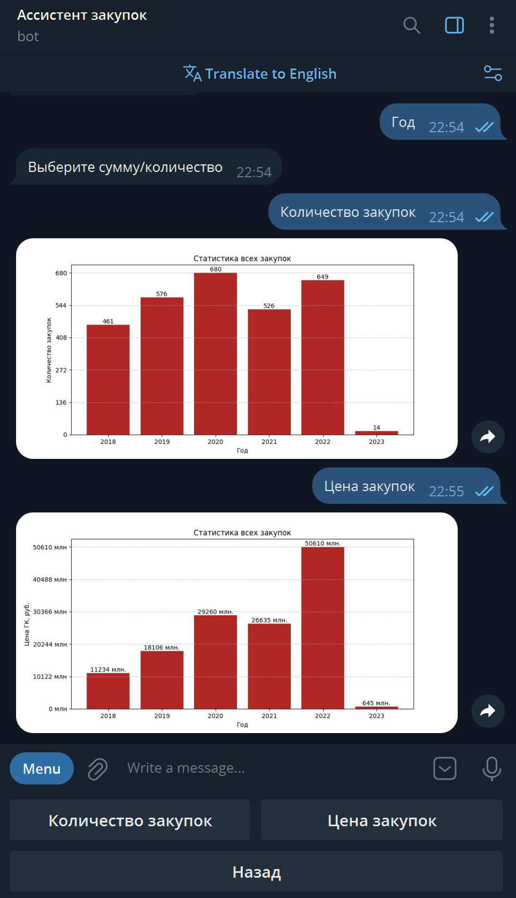

Наша команда разработала распределенную систему для прогнозирования и формирования закупок. Основным нашим преимуществом является простота системы, скорость взаимодействия и возможности, реализованные под решение конкретных проблем бизнеса (написать конкретику вместо общих слов)
# ЛЦТ-2024 | Решение команды «МИСИС Два миллиона»
## [Ссылка на админ-панель](https://purchasing-assistant.itatmisis.ru/#)
## [Ссылка на чат-бота](https://t.me/Purchasing_Assistant_bot)
*данные для входа в админ-панель указаны в документации к использованию сервиса*
## [Скринкаст работы сервиса](#)

## Архитектура

### Сервисы

#### Чат-бот

Мы реализовали чат-бот на основе Telegram API в виду его популярности среди пользователей и удобстве использования.


#### Основное API

Является ядром нашего решения. Данный сервис отвечает за **сохранение данных пользователя**, передает информацию о **предсказаниях** и **аналитике**, а также реализует систему авторизации. Он может быть **использован отдельно** от чат-бота, позволяя сохранить все основные возможности системы. Взаимодействие реализовано на основе протокола **HTTP**.

[Документация к API](https://purchasing-assistant.itatmisis.ru/api/docs)

#### Админ-панель

В панели администратора доступны следующие функции:
 * Зарегистрировать организацию.
 * Создавать новых пользователей.
 * Список пользователей.
 * Просматривать информацию уже существующих пользователей.
 * Редактировать информацию о существующих пользователей.
 * Удаление пользователей.
 Открытой регистрации для пользователей в админ-панели нет в целях избежания утечки данных.


### Инструкция по локальному запуску
```
1. git clone https://github.com/ParkieV/lct2024.git && cd lct2024
2. настройка переменных окружения и конфигураций
    2.1. backend/src/.envs/app.env # пример в .env.example
    2.2. backend/src/.envs/auth.env # пример в admin/config/config_example.yaml
    2.3. backend/src/.envs/db.env # пример в chat/config/config_example.yaml
    2.4. backend/src/.envs/redis.env # пример в api/config/config_example.yaml
3. docker compose up
```

## ML
---

[Документация к API](https://purchasing-assistant.itatmisis.ru/api_ml/docs)

## Backend
---
### Стек технологий
* **Python** - основной язык, на котором написано центральное API и телеграм-бот
* **FastAPI** - фреймворк для написания API сервисов
* **Pydantic** - валидация данных
* **SQLAlchemy** - взаимодействие с базой данных
* **PyJWT** - реализация JWT
* **Redis** - кэширование данных
* **Postgres** - основное хранилище данных
* **Asyncpg** - асинхронный драйвер для взаимодействия с PostgreSQL
* **Aiogramm** - асинхронная библиотека для написания тг-ботов
* **Aiohttp** - асинхронная библиотека для реализации API
* **Aiosqlite** - асинхронный драйвер для взаимодействия с локальным хранилищем SQLite
### Преимущества
Архитектура системы - **микросервисы**. Это позволяет системе быть **модульной**, **масштабируемой** и иметь возможность **заменить** и **дополнить** сервисы **без нарушения работы** системы.
Также можно выделить **простоту поддержки**, **высокую скорость** работы. Архитектура системы упрощена засчет сокращения количества подключаемых сервисов. Система **защищена** от несанкционированного доступа с помощью **JWT токенов** используемых для взаимодействия с сервисами приложения.

## Frontend
---
### Стек технологий
* **ReactJS**
* **Redux-Toolkit**
* **React-Router**
* **JavaScript**
* **WebPack5**
* **Babel**
* **HTML5**
* **CSS3**
### Преимущества

